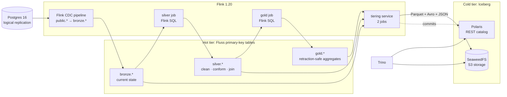

# Streaming lakehouse: Postgres → Apache Fluss → Apache Iceberg

[](LICENSE)


**Kafka, Debezium, Kafka Connect and a lake sink connector, replaced by one
system. It works, after nine fixes.**

[Apache Fluss](https://fluss.apache.org/) claims it can collapse the usual
CDC stack into a single streaming storage layer that tiers itself into a
lakehouse. I built that from scratch: Postgres changes stream into Fluss,
Flink SQL maintains bronze, silver and gold layers continuously, and Fluss
tiers every layer into Apache Iceberg on
[SeaweedFS](https://github.com/seaweedfs/seaweedfs), where Trino queries it.
There is no batch step anywhere.

The claim holds. Getting there meant working around upstream bugs, missing
jars and undocumented settings, and those nine findings are the most useful
part of this repo.

## Results at a glance

| | |
|---|---|
| **End to end** | Postgres `INSERT` / `UPDATE` / `DELETE` → queryable in Iceberg via Trino in **~30–150 s** |
| **Hot tier** | Postgres → Fluss is near-instant; Fluss primary-key tables support point lookups directly |
| **Gold correctness** | All 3 gold tables **equal the same aggregates computed in Postgres**, before and after live changes |
| **Retractions** | Cancelling and un-cancelling an order, renaming a category, inserting and deleting lines: gold converges back every time |
| **Coverage** | **14 tables** (6 bronze, 5 silver, 3 gold) tiered into Iceberg; full medallion check runs in **44–100 s** |
| **Open format** | Tiered output is plain Iceberg: Parquet data, Avro manifests, JSON metadata, read by Trino with zero Fluss-specific code |

## Architecture



Fluss is the hot tier for every layer and Iceberg is the cold tier for
every layer. Each Fluss table is tiered into an Iceberg namespace of the
same name.

| Layer | Tables | What it holds | Built by |
|---|---|---|---|
| `bronze` | the 6 source tables | Current state of each Postgres table, 1:1 | Flink CDC ([`postgres-to-fluss.yaml`](flink/postgres-to-fluss.yaml)) |
| `silver` | `customers`, `products`, `orders`, `order_lines`, `payments` | Trimmed and normalised text, `DECIMAL` money next to integer cents, `order_lines` joined with orders, products and categories | [`silver_job.sql`](flink/medallion/silver_job.sql) |
| `gold` | `daily_revenue_by_category`, `customer_lifetime_value`, `order_status_summary` | Business aggregates, excluding cancelled orders where relevant | [`gold_job.sql`](flink/medallion/gold_job.sql) |

Three design choices:

- **Regular streaming joins in silver, not lookup joins.** A lookup join is
  cheaper but not retroactive: renaming a category wouldn't update order
  lines already emitted, and an order item that arrives before its product
  during the snapshot would be dropped for good. A regular join re-emits
  when either side changes, so silver stays an exact function of bronze.
- **Gold is retraction-safe.** Fluss primary-key tables emit a full
  changelog (`-U/+U/-D`), and `COUNT`, `SUM`, `COUNT(DISTINCT)` and
  `MIN`/`MAX` all retract. A cancelled order's revenue leaves gold in place,
  and a group whose last row is retracted is deleted, matching Postgres's
  `GROUP BY`.
- **Money is kept in integer cents** next to the `DECIMAL` columns, so gold
  reconciles exactly against Postgres.

## Run it

Requires Docker Compose v2 with enough memory for a 4 GB Flink
TaskManager plus the other services.

```bash
make smoke   # up, submit all jobs with built-in waits, then verify bronze and gold
```

Or step by step:

```bash
make up                # SeaweedFS, Polaris, Fluss, Flink, Trino, Postgres
make submit-pipeline   # Postgres -> Fluss CDC job
make submit-tiering    # 2 Fluss -> Iceberg tiering jobs (TIERING_JOBS=2)
make submit-medallion  # bronze -> silver and silver -> gold jobs (guarded against duplicates)
make verify            # bronze: row counts + live insert/update/delete through to Iceberg
make verify-medallion  # gold reconciled against Postgres + live retraction test
```

The gold check, trimmed:

```
== Step 1: layers exist in Iceberg (via Trino) ==
  all 14 tables present

== Step 2: gold reconciles with Postgres ==
  daily_revenue_by_category    OK
  customer_lifetime_value      OK
  order_status_summary         OK

== Step 3: live mutations -> gold converges again ==
  toggling order_id=5 between 'paid' and 'cancelled'...
  toggling a ' (renamed)' suffix on category_id=3...
  inserting a new order with 2 lines, then deleting one line...
  daily_revenue_by_category    OK
  customer_lifetime_value      OK
  order_status_summary         OK

Medallion verification PASSED.
```

| UI | URL |
|---|---|
| Flink dashboard | http://localhost:8082 |
| Trino | http://localhost:8080 |
| Polaris REST catalog | http://localhost:8181 |
| SeaweedFS S3 / admin | http://localhost:8333 · http://localhost:23646 |

`make status` shows Flink job states. `make down` stops the stack and keeps
data, and `make reset` wipes it.

## Nine things that broke

Tested against Fluss 0.9.1-incubating, Flink CDC 3.6.0, Flink 1.20 and
Iceberg 1.10.1. Findings 1–5 blocked the CDC pipeline, and 6–9 blocked the
medallion, in the order I hit them. Expand any row for the full story.

| # | Symptom | Root cause | Fix |
|---|---|---|---|
| 1 | Fluss sink rejects `TIMESTAMPTZ`; the `CAST` workaround crashes too | Unsupported type in Fluss, plus a separate Flink CDC transform bug | Plain `TIMESTAMP` in the source schema |
| 2 | `ClassNotFoundException`, then `Missing S3FileIO` | Fluss image ships none of the S3/Iceberg jars; `iceberg-aws-bundle` doesn't contain `S3FileIO` | Add 4 jars to Fluss and Flink; set `io-impl` explicitly |
| 3 | Snapshot loads, then live changes **silently never arrive** | Flink CDC only switches to streaming after a checkpoint, and none was configured | `execution.checkpointing.interval=10s` |
| 4 | First `UPDATE` or `DELETE` crash-loops the whole job | Flink CDC NPE on the null columns `REPLICA IDENTITY DEFAULT` sends | `REPLICA IDENTITY FULL` on every table |
| 5 | Fluss starts with empty credentials and never recovers | Compose snapshots `env_file` before the bootstrap writes it | Entrypoint wrapper reads creds at every start |
| 6 | One `DATE` column **stops tiering for every table** | Fluss's Iceberg writer passes a date object, not an int; tiering has no restart | ISO date `STRING` |
| 7 | `CREATE TABLE` fails on a composite primary key | Iceberg integration supports only one bucket key | `'bucket.key' = 'category_id'` |
| 8 | `CREATE TABLE IF NOT EXISTS` fails on re-run | Fails once the Iceberg twin exists; `DROP ... CASCADE` orphans Iceberg tables | Split DDL from jobs; create a layer only when it's absent |
| 9 | Submit script reports success with no job running | `sql-client.sh -f` exits 0 on `[ERROR]` (here: reserved word `method`) | Grep output for `[ERROR]`; backtick `method` |

<details>
<summary><b>1. Fluss doesn't support <code>TIMESTAMP WITH TIME ZONE</code>, and the obvious workaround crashes</b></summary>

Postgres's `TIMESTAMPTZ` maps to Flink CDC's `ZonedTimestampType`, which
the Fluss sink rejects: `Unsupported data type in fluss TIMESTAMP(6) WITH
TIME ZONE`.

`CAST(col AS TIMESTAMP)` in a `transform` rule hits a separate upstream bug
in Flink CDC 3.6.0's transform module: a `NumberFormatException` in
`BinaryRecordData.getZonedTimestamp`, thrown while `PreTransformOperator`
fills in the row's *other* fields, before the cast runs. The same issue is
reported against a different sink in
[flink-cdc#4163](https://github.com/apache/flink-cdc/discussions/4163).

**Fix:** [`postgres/init/01_schema.sql`](postgres/init/01_schema.sql) uses
plain `TIMESTAMP` columns. Worth re-testing on a newer Flink CDC release.

</details>

<details>
<summary><b>2. Neither Fluss nor the tiering service ships the jars for S3-backed Iceberg</b></summary>

`apache/fluss:0.9.1-incubating` bundles `fluss-lake-iceberg` and nothing
else. Two failures, in order:

- `ClassNotFoundException: org.apache.hadoop.conf.Configurable`. Iceberg's
  `CatalogUtil.loadFileIO` touches Hadoop's `Configurable` even when the
  FileIO is S3-based.
- `Missing org.apache.iceberg.aws.s3.S3FileIO`. **`iceberg-aws-bundle`,
  despite the name, does not contain `S3FileIO`.** It holds only the shaded
  AWS SDK. The class lives in the separate `iceberg-aws` jar. Inspecting
  the bundle jar showed zero `S3FileIO` entries.

**Fix:** [`fluss/Dockerfile`](fluss/Dockerfile) adds `iceberg-aws`,
`iceberg-aws-bundle`, `hadoop-apache` and `failsafe` to
`${FLUSS_HOME}/plugins/iceberg/`. The coordinator and tablet servers open
an Iceberg catalog client themselves, not just the tiering job. The same
four jars go into `${FLINK_HOME}/lib` in [`flink/Dockerfile`](flink/Dockerfile).

Even with the jars, Iceberg's `ResolvingFileIO` falls back to `HadoopFileIO`
for `s3://` paths and throws a misleading `No FileSystem for scheme s3`.
Setting `datalake.iceberg.io-impl: org.apache.iceberg.aws.s3.S3FileIO`
fixes it. That setting isn't on Fluss's Iceberg page; I found it by reading
the exception's `DynConstructors` call chain.

</details>

<details>
<summary><b>3. Without a checkpoint interval, streaming silently never starts</b></summary>

Flink CDC's `SnapshotSplitAssigner` only moves the Postgres source from
snapshot to streaming **after a checkpoint completes** following the last
snapshot chunk. Flink CDC 3.5+ removed the checkpointing defaults older
docs assume, and this image's Flink config has none.

The job logs `Snapshot split assigner received all splits finished, waiting
for a complete checkpoint to mark the assigner finished` and then sits
there. Snapshot data arrives, but every later insert is silently ignored:
no error, no warning, job still `RUNNING`.

**Fix:** [`flink/run-cdc-pipeline.sh`](flink/run-cdc-pipeline.sh) passes
`-D execution.checkpointing.interval=10s`.

</details>

<details>
<summary><b>4. The default <code>REPLICA IDENTITY</code> crash-loops the pipeline on the first UPDATE</b></summary>

With `REPLICA IDENTITY DEFAULT`, UPDATE and DELETE WAL records carry only
the primary key in the before-image, and every other column is `NULL`.
Flink CDC 3.6.0's `DebeziumSchemaDataTypeInference.inferStruct` throws a
bare `NullPointerException` on those fields. All 4 pipeline tasks restart,
repeatedly, on every checkpoint restore, from the first UPDATE or DELETE
onward.

**Fix:** `ALTER TABLE ... REPLICA IDENTITY FULL` on every captured table in
[`postgres/init/01_schema.sql`](postgres/init/01_schema.sql).

</details>

<details>
<summary><b>5. Compose bakes in <code>env_file</code> before the file has real contents</b></summary>

The Fluss servers need `FLUSS_CLIENT_ID`/`FLUSS_CLIENT_SECRET`, which
`polaris-bootstrap` writes to `polaris/creds.env` at runtime. `env_file` plus
`depends_on: condition: service_completed_successfully` looks right but
isn't. On a cold start, Compose created `fluss-coordinator`, snapshotting
`env_file`, 60 seconds before `polaris-bootstrap` finished writing. The
coordinator got empty credentials, and because `restart: unless-stopped`
restarts the *same* container, it retried forever with
`NotAuthorizedException: invalid_client`.

**Fix:** [`fluss/docker-entrypoint-wrapper.sh`](fluss/docker-entrypoint-wrapper.sh)
sources `/polaris/creds.env` on every start, then hands off to the image's
entrypoint. The file is mounted read-only instead of used as `env_file`.

A related detail: `FLUSS_PROPERTIES` references `$FLUSS_CLIENT_ID`, which the
Fluss image resolves with `envsubst`. In `docker-compose.yml` it's escaped
as `$$FLUSS_CLIENT_ID`, so Compose doesn't substitute an empty value first.

</details>

<details>
<summary><b>6. One <code>DATE</code> column stops tiering for every table</b></summary>

A silver table with a `DATE` column was created and written fine, but both
tiering jobs then failed: `IllegalStateException: Not an instance of
java.lang.Integer: 2026-09-07`. Fluss 0.9.1's Iceberg writer passes a date
object where Iceberg expects an int day count. Tiering jobs run with
`NoRestartBackoffTimeStrategy`, so the job goes `FAILED` and **every**
table stops tiering. It first showed up as a bronze UPDATE that never
reached Trino, nothing obviously date-related.

**Fix:** `order_date` is an ISO `STRING` (`DATE_FORMAT(created_at,
'yyyy-MM-dd')`), which still sorts and compares correctly. `DECIMAL`
columns tier fine.

</details>

<details>
<summary><b>7. Composite primary keys need a single <code>bucket.key</code> for Iceberg</b></summary>

`gold.daily_revenue_by_category` has `PRIMARY KEY (order_date, category_id)`.
The bucket key defaults to the whole primary key, which the Iceberg
integration rejects: `UnsupportedOperationException: Only one bucket key is
supported for Iceberg at the moment`.

**Fix:** `'bucket.key' = 'category_id'` in the table's `WITH` clause.

</details>

<details>
<summary><b>8. <code>CREATE TABLE IF NOT EXISTS</code> isn't re-runnable for lake-enabled tables</b></summary>

Once a `table.datalake.enabled` table's Iceberg twin exists, `CREATE TABLE
IF NOT EXISTS` fails with `CatalogException: Table silver.customers already
exists`, even though the Fluss table exists too. `DROP DATABASE ...
CASCADE` drops the Fluss tables but **leaves their Iceberg tables in
Polaris**, so drop-and-recreate fails the same way. The orphans have to be
deleted through Polaris's REST API as the writer principal, because Trino's
principal is read-only.

**Fix:** DDL is split from the jobs (`*_tables.sql` vs `*_job.sql`).
[`run-medallion.sh`](flink/run-medallion.sh) creates a layer's tables only
when none exist, skips creation when all exist, and refuses to guess on a
partial layer.

</details>

<details>
<summary><b>9. <code>sql-client.sh -f</code> exits 0 when a statement fails</b></summary>

A failed statement prints `[ERROR]` and stops the file, but the process
exits 0, so the submit script reported success with no job running. It hid
the first silver failure, caused by `method` (a `payments` column) being a
reserved word in Flink SQL.

**Fix:** `run-medallion.sh` greps the client output for `[ERROR]` and fails
loudly, and `method` is backtick-quoted.

</details>

<details>
<summary><b>Smaller friction</b></summary>

- **Root-owned volumes.** The Fluss image runs as uid 9999, so a fresh named
  volume made the tablet server crash-loop on `Permission denied`. A
  one-shot `fluss-tablet-data-init` container `chown`s it first.
- **SeaweedFS STS was never exercised.** I expected Polaris's credential
  vending to hit the instability in
  [seaweedfs#8312](https://github.com/seaweedfs/seaweedfs/discussions/8312).
  In practice Fluss and Polaris use static keys against SeaweedFS. Trino
  requests vended credentials from Polaris, but Polaris's own S3 calls stay
  static. It's an open question for anyone who needs scoped, short-lived
  credentials on SeaweedFS.

</details>

## Why Fluss instead of Kafka + Debezium?

| | Kafka + Debezium + Connect | Fluss (this repo) |
|---|---|---|
| **CDC capture** | Debezium source connector | Flink CDC's built-in `postgres-cdc` connector |
| **Storage format** | Row-based topics (often JSON) | Columnar log + primary-key tables (Arrow-based) |
| **Current state / point lookups** | Needs a separate store | Native primary-key tables |
| **Lakehouse sink** | A separate sink connector to run | Tiering is built into Fluss |
| **Cold data** | Wherever the sink writes | Standard Iceberg, readable by any Iceberg engine |
| **Maturity** | Years of production use, large community | Young: 9 findings in this build alone |

**Verdict:** the core promise holds. One system gives you a changelog, a
queryable current state and a self-maintaining Iceberg copy. The price
today is integration edges that the Kafka ecosystem smoothed off long ago,
especially between Fluss and Flink CDC's newer pipeline framework for
Postgres. I'd pick it for a new streaming lakehouse where the team can
absorb that, and pin versions carefully.

## What I'd change for production

| Gap | Risk | What I'd do |
|---|---|---|
| One table can stop all tiering (finding 6) | Every layer silently stops reaching Iceberg | Alert on tiering job state; add a restart strategy |
| No HA | Single JobManager, Fluss coordinator, tablet server and ZooKeeper | HA Flink, multiple Fluss servers, a ZooKeeper ensemble |
| `weed mini` SeaweedFS | Single process, no replication | Separate master, volume and filer with replication |
| Static S3 credentials | Broad, long-lived keys | Scoped STS vending once SeaweedFS's STS matures |
| Tiering freshness (30 s per table, queued) | Lag grows with table count and throughput | Tune `table.datalake.freshness` and `TIERING_JOBS` |
| Unbounded join and aggregate state | Heap state grows forever | RocksDB + `table.exec.state.ttl`, or lookup joins where staleness is fine |
| Schema changes stop at bronze | Dropping a column silver reads fails the silver job | Versioned silver/gold DDL with a migration runbook |
| No monitoring or CI | Failures found by hand | Fluss's Prometheus/Grafana quickstart; run `make smoke` in CI |

## Under the hood

<details>
<summary><b>Services</b></summary>

| Service | Role |
|---|---|
| `source-postgres` | CDC source |
| `flink-jobmanager` / `flink-taskmanager` | CDC pipeline, 2 tiering jobs, silver and gold jobs (8 slots, 6 used, 4 GB) |
| `fluss-coordinator` / `fluss-tablet` | The Fluss cluster (hot tier) |
| `zookeeper` | Fluss's metadata store (Fluss has no KRaft equivalent yet) |
| `seaweedfs` | S3-compatible storage (`weed mini`: master, volume, filer and S3 gateway in one process) |
| `polaris` / `polaris-postgres` | Iceberg REST catalog and its metastore |
| `trino` | Query engine, reads Iceberg through Polaris |

</details>

<details>
<summary><b>Upgrading an existing stack</b></summary>

Run `make reset` and `docker compose build flink-jobmanager
flink-taskmanager` first. `make up` reuses a cached Flink image, and old
`public.*` tables and CDC slot offsets don't carry over to `bronze.*`.

</details>

<details>
<summary><b>Repo layout</b></summary>

```
docker-compose.yml                  All services
fluss/Dockerfile                    apache/fluss + the missing Iceberg/S3/Hadoop jars (finding 2)
fluss/docker-entrypoint-wrapper.sh  Reads polaris/creds.env at every start (finding 5)
flink/Dockerfile                    Flink 1.20 + Flink CDC + Fluss connectors + tiering jars
flink/postgres-to-fluss.yaml        CDC pipeline definition (public.* -> bronze.*)
flink/run-cdc-pipeline.sh           Renders env vars into the pipeline and submits it
flink/run-tiering-service.sh        Submits one Fluss -> Iceberg tiering job
flink/run-medallion.sh              Waits for bronze, creates missing layers, submits both jobs
flink/medallion/init.sql            Fluss catalog + streaming settings
flink/medallion/*_tables.sql        Silver / gold table DDL (lake-enabled)
flink/medallion/*_job.sql           bronze -> silver and silver -> gold jobs
polaris/bootstrap.sh                Polaris catalog, namespaces, principals, grants
postgres/init/                      Source schema (REPLICA IDENTITY FULL, plain TIMESTAMP) + seed
trino/etc/                          Trino config, including the Iceberg/Polaris catalog
scripts/verify_pipeline.sh          Bronze: row counts + live CDC through to Iceberg
scripts/verify_medallion.sh         Gold reconciled against Postgres + live retraction test
```

</details>

## License

[MIT](LICENSE)
